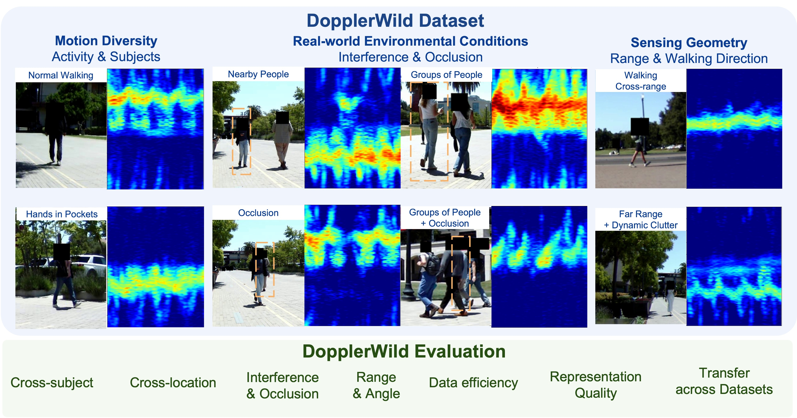

# DopplerWild: A Doppler Dataset and Benchmark for Human Kinematic Understanding in the Wild



Code for **DopplerWild: A Doppler Dataset and Benchmark for Human Kinematic
Understanding in the Wild**.

This repository contains the reported supervised baselines and self-supervised (contrastive, reconstruction) evaluation pipelines.

Project page: <https://dopplerwild.github.io/DopplerWild-web/>

---

## Overview
- [1. Environment Setup](#1-environment-setup) — Venv + pinned `requirements.txt`.
- [2. Dataset and Checkpoints](#2-dataset-and-checkpoints) — Kaggle download for the radar uD tracks and the released reconstruction / contrastive backbones.
- [3. Quickstart](#3-quickstart) — Commands for evaluating supervised + SSL checkpoints with `eval.py` and training with `train.py`.
- [4. SSL Pretraining](#4-ssl-pretraining) — Train backbone encoders from scratch on unlabeled tracks (contrastive and reconstruction).
- [5. Configuration](#5-configuration) — Where to set the output directory, dataset paths, model, and CV knobs in the Hydra configs.
- [Citation](#citation)

---

## 1. Environment Setup

We provide a pinned `requirements.txt` (CUDA 12.8, PyTorch 2.10). The codebase has been tested with Python 3.10.12.

```bash
git clone https://github.com/dopplerwild/DopplerWild.git
cd DopplerWild

python3 -m venv .venv
source .venv/bin/activate

pip install -r requirements.txt
```

Verify the install:

```bash
python -c "import torch; print(torch.__version__, torch.cuda.is_available())"
```

---

## 2. Dataset and Checkpoints

The dataset is hosted on Kaggle:

- Dataset: <https://www.kaggle.com/datasets/dopplerwild/dopplerwild>

Download into the repo root:

```bash
curl -L -o dopplerwild.zip \
  https://www.kaggle.com/api/v1/datasets/download/dopplerwild/dopplerwild

unzip dopplerwild.zip

mv DopplerWild data
```

The unzipped layout matches the defaults in `conf/eval.yaml` and
`conf/train.yaml` — `data/labeled_tracks_Doppler/`,
`data/checkpoints/ssl_pretraining/`, `data/fold_splits/`, etc.

---

## 3. Quickstart

### 3.1 Evaluate a checkpoint

**Validate from a saved checkpoint** — driven by the unified
[conf/eval.yaml](conf/eval.yaml). Pick the row that matches the trained
checkpoint; `<run_dir>` is the directory written by training:

| Method | Task | Command |
|---|---|---|
| Supervised | MotionState | `python eval.py method_name=supervised task_name=MotionState` |
| Supervised | VelocityRegression | `python eval.py method_name=supervised task_name=VelocityRegression` |
| Supervised | SingleHand | `python eval.py method_name=supervised task_name=SingleHand` |
| Reconstruction | MotionState | `python eval.py method_name=reconstruction task_name=MotionState` |
| Reconstruction | VelocityRegression | `python eval.py method_name=reconstruction task_name=VelocityRegression` |
| Reconstruction | SingleHand | `python eval.py method_name=reconstruction task_name=SingleHand` |
| Contrastive | MotionState | `python eval.py method_name=contrastive task_name=MotionState` |
| Contrastive | VelocityRegression | `python eval.py method_name=contrastive task_name=VelocityRegression` |
| Contrastive | SingleHand | `python eval.py method_name=contrastive task_name=SingleHand` |

Append `model_name=resnet18` to any of the rows above to evaluate the
ResNet-18 variant, e.g.

```
python eval.py task_name=MotionState model_name=resnet18
```

Append `cross_location=True` to any of the rows above to evaluate on location-based splits

```
python eval.py task_name=MotionState cross_location=True
```

`eval_checkpoint_dir` should contain one `fold_{fold_name}.pt` per fold (e.g.
`fold0.pt`, `fold1.pt`, `fold2.pt` for 3-fold cross-subject, or
`fold_A.pt`, `fold_B.pt`, … for cross-location). For reconstruction /
contrastive checkpoints, `eval.py` also needs the SSL pretraining encoder
to rebuild the backbone — pass `paths.ckpt=<pretraining_ckpt>` or rely on
the auto-derived path `<ssl_ckpts_dir>/<method_name>_pretraining_<model_name>_epoch300.pt`.
Per-fold predictions are written to `output_dir` (default:
`<eval_checkpoint_dir>/eval/`) as `predictions_<fold_name>.csv`.

### 3.2 Training

Pick the row matching the (method, task) pair you want — every command runs
cross-validated training and writes all per-fold artifacts under a
**single** run directory at `<output_dir>/<exp_name>/`. Folds are
distinguished by filename suffix (`fold0`, `fold1`, … for cross-subject
CV; `fold_<location>` under cross-location CV) rather than by separate
subdirectories.

| Method | Task | Command |
|---|---|---|
| Supervised | MotionState | `python train.py method=supervised task_name=MotionState` |
| Supervised | VelocityRegression | `python train.py method=supervised task_name=VelocityRegression` |
| Supervised | SingleHand | `python train.py method=supervised task_name=SingleHand` |
| Reconstruction | MotionState | `python train.py method=reconstruction task_name=MotionState` |
| Reconstruction | VelocityRegression | `python train.py method=reconstruction task_name=VelocityRegression` |
| Reconstruction | SingleHand | `python train.py method=reconstruction task_name=SingleHand` |
| Contrastive | MotionState | `python train.py method=contrastive task_name=MotionState` |
| Contrastive | VelocityRegression | `python train.py method=contrastive task_name=VelocityRegression` |
| Contrastive | SingleHand | `python train.py method=contrastive task_name=SingleHand` |


Switch the backbone via `model_name=` — every (method, task) combo
also accepts the released ResNet-18 variant:

```bash
python train.py task_name=MotionState model_name=resnet18
```

Append other Hydra overrides the same way, e.g.

```bash
python train.py train.epochs=50
python train.py method=reconstruction paths.ckpt=data/checkpoints/ssl_pretraining/reconstruction_pretraining_mobilenet_v2_epoch300.pt
```

The run directory `<output_dir>/<exp_name>/` contains, for each fold:

- `<fold_name>.pt` — checkpoint from the final training epoch (e.g.
  `fold0.pt`, `fold_A.pt`). This is the file consumed by `eval.py`
  (see §3.1).
- `predictions_<fold_name>.csv` — final-test predictions.

A single `metrics_summary.txt` is written at the run-dir level summarizing
metrics across folds; no per-fold metrics CSV, config YAML, or
confusion-matrix image is produced.

### 3.3 SSL Checkpoint Variants and Overrides

The released reconstruction and contrastive backbones are evaluated through `train.py`
with `method=reconstruction` or `method=contrastive`. Both load the pretrained backbone
specified by `paths.ckpt`, run the configured eval variants over the folds
selected by `cross_location` (4 location-based folds when
`True`, otherwise 3 fold-index splits), and write per-variant artifacts
under a single run directory `<output_dir>/<run_tag>/`, with one
`predictions_<fold_name>.csv` per fold and a single `metrics_summary.txt`
at the run-dir level. Activity-KNN predictions land in a `knn/` subfolder.
Multi-variant linear probes nest under `<variant_slug>/` per variant.

By default each run trains and reports **three eval variants** plus a KNN
probe.

| Variant | Backbone | Head |
|---|---|---|
| `linear_probe` | frozen | linear |
| `frozen_backbone_nonlinear_head` | frozen | MLP (`hidden_dims=[1024]`) |
| `full_finetune_nonlinear_head` | trainable | MLP (`hidden_dims=[1024]`) |

**Reconstruction — fold-based CV (3 folds):**

```bash
python train.py method=reconstruction \
  paths.ckpt=data/checkpoints/ssl_pretraining/reconstruction_pretraining_mobilenet_v2_epoch300.pt \
  output_dir=./outputs/ssl_mae_tune/
```

**Contrastive — same protocol:**

```bash
python train.py method=contrastive \
  paths.ckpt=data/checkpoints/ssl_pretraining/contrastive_pretraining_mobilenet_v2_epoch300.pt \
  output_dir=./outputs/ssl_contrastive_tune/
```

**Cross-location CV** (iterate over the 4 locations instead of fold indices):

```bash
python train.py method=reconstruction \
  paths.ckpt=data/checkpoints/ssl_pretraining/reconstruction_pretraining_mobilenet_v2_epoch300.pt \
  output_dir=./outputs/ssl_mae_tune/ \
  cross_location=True
```

**CLI-overridable knobs** (work for both methods unless noted):

| Override | Purpose |
|---|---|
| `train.epochs=N` | Training epochs for each linear-probe variant |
| `train.learning_rate=5e-5` | Initial LR |
| `model_name=mobilenet_v2` | Must match the backbone the checkpoint was pretrained with |
| `train_percent=25` | Data-efficiency sweep (use only a fraction of train) |
| `cross_location=True` | Switch to 4-fold location CV |
| `task_name=...` | Pick a different task |
---

## 4. SSL Pretraining

The [self_supervised_pretrain/](self_supervised_pretrain/) folder contains scripts to pretrain backbone encoders from scratch on **unlabeled** micro-Doppler tracks — this is only needed if you want to reproduce or extend the pretraining. To evaluate the released checkpoints, skip to §3.

See **[self_supervised_pretrain/README.md](self_supervised_pretrain/README.md)** for full instructions, including data format, run commands, key arguments, and augmentation details.

---

## 5. Configuration
### YAML — what's exposed per run

The fields below are the only ones present in the stripped configs. Override
on the CLI or by editing the YAML.

| Field | Purpose |
|---|---|
| `task_name` | Task variant. Built-ins: `MotionState`, `SingleHand` (classification); `VelocityRegression` (regression). |
| `data_dir` | Radar `.npz` directory |
| `model_name` | `mobilenet_v2` \| `resnet18` |
| `paths.ckpt` | SSL eval only — pretrained backbone |

For SSL eval, set `paths.ckpt` to your downloaded checkpoint and
`output_dir` to your desired output directory.

---
## License
The code in this repository is released under the Apache License 2.0. The DopplerWild dataset is released under CC BY 4.0.

---

## Citation

```bibtex
@misc{anonymous2026dopplerwild,
  title        = {DopplerWild: A Doppler Dataset and Benchmark for Human Kinematic Understanding in the Wild},
  author       = {Anonymous Authors},
  year         = {2026}
}
```
